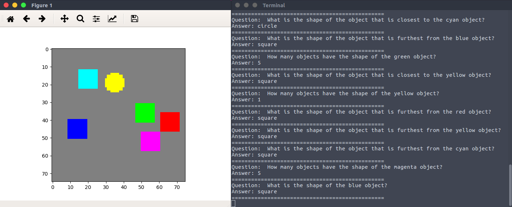
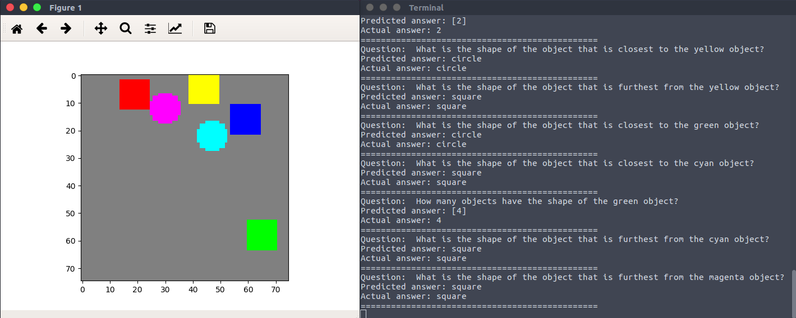

# Relation Networks
This is a Tensorflow implementation of 
[A simple neural network module for relational reasoning](https://arxiv.org/abs/1706.01427).
Currently only the simple *Sort-of-CLEVR* dataset (described in paper) is implemented. 
This dataset simplifies the problem by considering a smaller space of questions that can
be encoded as binary strings and thus bypassing the need for a model to parse 
natural language but still retaining the need for relational reasoning.

## Sort-of-CLEVR
```bash
$ python -m rn.data.sort_of_clevr.inspect
```



## Training
```bash
$ python -m rn.train
```

## Results
```bash
$ python -m rn.predict --checkpoint path/to/checkpoint
```



TODO: Show fail cases.
TODO: Show loss curves.